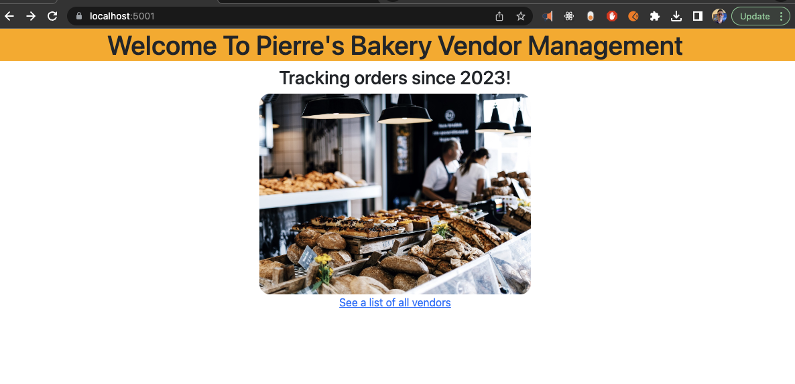

# _{Pierre's Vendor Management MVC with ASP.NET Core}_

#### By _**{Dan Kiss}**_

#### _{Pierre's Vendor Management MVC is an ASP.NET Core MVC app written in C# where the user will add Vendors and once a the Vendor is made Order can be added to each Vendor.}_

## Technologies Used

* ASP.NET Core MVC
* .NET Core
* C#
* MS Test (Microsoft)

## Description

To run the application navigate to the VendorManager folder in the command line and run 

$ dotnet run

To run the tests navigate to the VendorManager.Tests folder and run

 $ dotnet test

## Setup/Installation Requirements

* _Navigate to the VendorManager.Tests folder and run_
* _$ dotnet restore_
* _confirm testing passed with $ dotnet test_
* _Now navigate back to the folder Navigate to the VendorManager folder in terminal_
* _run $ dotnet run_
* _Go to localhost:5001_
* _Click to see a list of all vendors_
* _Add a vendor_
* _Click the added vendor_
* _To make a Order associated with the vendor click Add New Order_
* _You will see orders you entered be associated to the vendor_

_{Double check that the bin and obj folders are created in both VendorManager and VendorManager.Tests}_

## Known Bugs

* _None_

## Idea to expand on

* _Allow the name of vendor to be edited, allow the order to be edited, change the system used to make the Id for Vendors and Orders, remove Vendors and Orders. Add styling.

## Git Note
Remove bin and obj folders from git with 
$ git rm --cached obj -r 
$ git rm --cached bin -r

## License

_{MIT License}_

Copyright (c) _2023_ _Daniel Kiss_